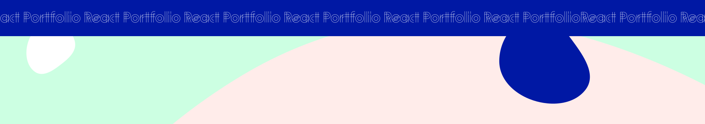
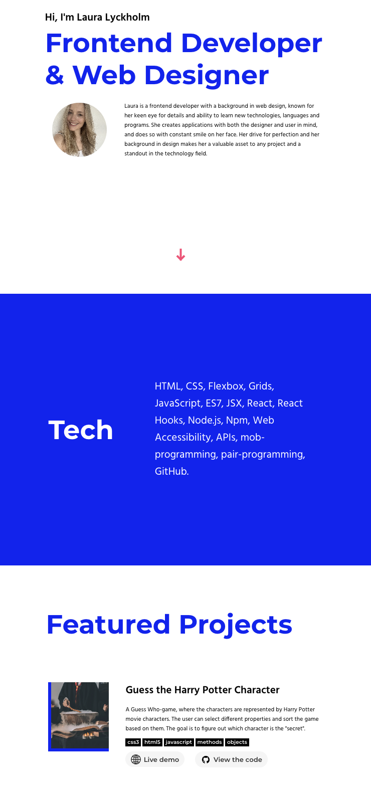

<h1 align="center">
  
</h1>

## Author

### Hi, I'm Laura! 👋

I am a Frontend Developer and Web Designer with a bachelor’s degree in healthcare. I am someone who is driven by constant growth and learning, whether it involves new languages, technologies, or tools. At the same time, I am passionate about precision and creating visually appealing, user friendly applications with both designers and end users in mind.

Problem solving is something I truly love and commit to wholeheartedly. Ask anyone around me and they will tell you that I never give up when someone asks for help. I see problem solving as everyday puzzles, which is probably why I also enjoy solving actual puzzles of all kinds in my free time.

I am a thoughtful and caring person who thrives best when the people around me feel good and are happy. That is why I always do my best to spread positivity in my surroundings. Teamwork and collaboration are natural to me, while I also work very efficiently on my own.

Top skills:
Vue, React, Figma, HTML, CSS, JavaScript, TypeScript, Storyblok, Litium, MongoDB/Atlas, Postman, DevOps, Adobe Creative Suite, Express.js, Zustand, Node.js, Asana, Google Sheets, Excel, Nursing care and strong interpersonal skills.

## Screenshots

