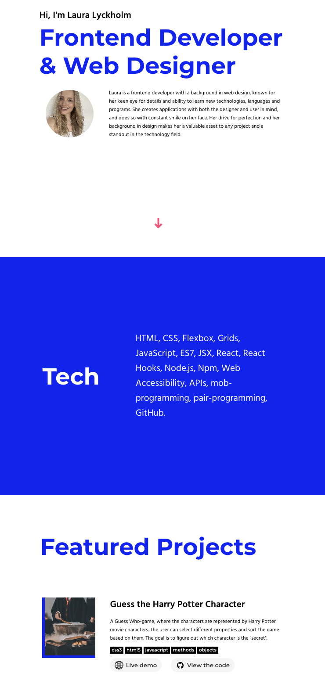

<h1 align="center">
  
</h1>

## Author

### Hi, I'm Laura! 👋

Welcome to my portfolio! I am Laura, a student who has completed Sprint 2 of Technigos Web Dev Bootcamp and is now taking my skills to the next level. This is a living project, constantly changing as it fits. In creating this portfolio, I got to further excercise the use of React hooks, components and props in React, as well as deep-diving into CSS, accessibility and following and implementing a Figma design to create a dynamic and interactive website. 

By breaking down the project into reusable components and efficiently passing data with props, I've ensured a well-structured and organized codebase. Utilizing React hooks has allowed me to manage reactive data and create an engaging user experience.

A standout feature of my portfolio is the seamless integration of web APIs, using useEffect to fetch project information from the GitHub API to fill the Featured Projects section. This ensures that my portfolio stays up-to-date with my latest work, dynamically displaying project details and descriptions.

I've paid close attention to responsive design and CSS, utilizing CSS Grid and Flexbox to adapt the layout to various devices. Accessibility has been a priority, following guidelines to make my website usable by all users. Additionally, I've made effective use of comments and code documentation to explain complex logic and ensure maintainable code.

Please note that the articles in the portfolio, at the time of its first creation, aren't real. This section was part of the requirements for finishing the project during the Bootcamp, and the texts are written by ChatGpt. The buttons are at the moment linking to the section of articles, to make it functional. In the future, this section is supposed to be filled out with real articles written by me. 

This portfolio is just the beginning of my coding journey. As I continue to grow and evolve, my portfolio will reflect my progress and creativity. Feel free to explore my GitHub repository and visit the live deployment link to see my work in action. Happy coding and enjoy the journey with me!

### Lessons Learned

Through this project, I, Laura, have learned invaluable lessons in React development. I now understand the power of components and props in creating a modular and organized codebase. React hooks, especially useState, have allowed me to manage state and interactivity effectively. Integrating web APIs taught me the importance of data fetching and dynamic content display, keeping my portfolio up-to-date effortlessly. Additionally, focusing on accessibility has made me more aware of creating inclusive user experiences. Overall, this project has honed my skills in clean coding practices and emphasized the significance of continuous testing and deployment for a successful web application. The experience has been enriching, and I am excited to apply these lessons in future projects to further enhance my coding journey.

## Screenshots

